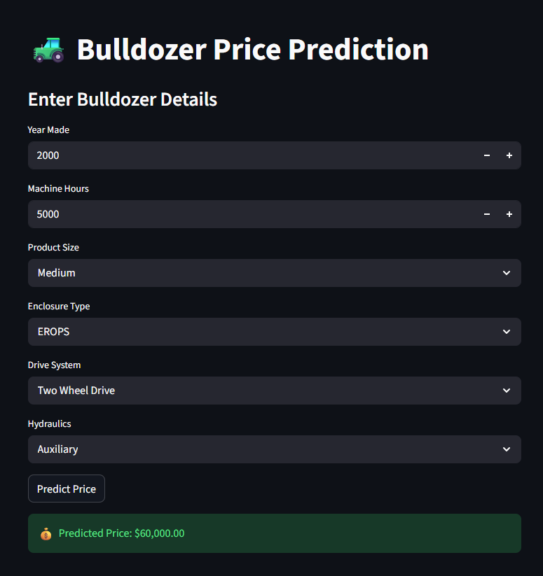

# 🚜 Bulldozer Price Prediction

An end-to-end Machine Learning project for predicting bulldozer sale prices using Scikit-Learn and Random Forest Regressor.

This project includes:
- Data preprocessing
- Feature engineering
- Exploratory Data Analysis (EDA)
- Model training and evaluation
- Feature importance analysis
- Streamlit web application for predictions

---

## 📌 Problem Statement

The goal of this project is to predict the future sale price of bulldozers based on machine-related features and historical sales data.

---

## 🛠 Technologies Used

- Python
- Pandas
- NumPy
- Scikit-Learn
- Matplotlib
- Jupyter Notebook
- Streamlit

---

## 📊 Machine Learning Workflow

1. Data loading and preprocessing
2. Handling missing values
3. Converting categorical features
4. Feature engineering
5. Model training using RandomForestRegressor
6. Model evaluation
7. Prediction on test data
8. Streamlit app deployment

---

## 🚀 Streamlit App

The project also includes a Streamlit web application where users can input bulldozer details and get predicted prices instantly.

---

## 📷 App UI



---

## 📁 Project Structure

```bash
bulldozer-price-prediction/
│
├── app.py
├── environment.yml
├── README.md
├── end-to-end-bluebook-bulldozer-price-regression.ipynb
└── app-ui.png.png
```

---

## 📈 Model Used

- Random Forest Regressor

---

## 🙌 Acknowledgements

This project was built as part of my Machine Learning learning journey and practice on structured data projects.
